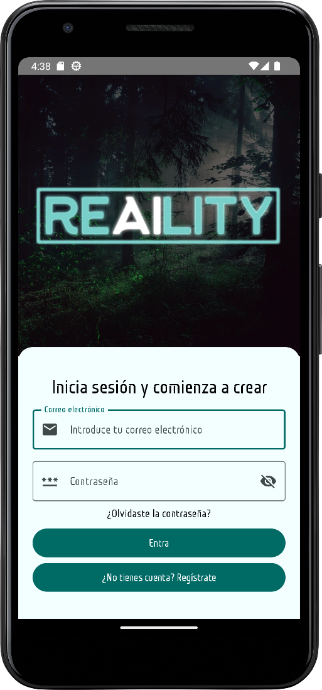

# Re-AI-lity App
<p align="center">
  
</p>
## Description
This is an app to share your prompting creativity using OpenAI's DALL-E image generator.
It will allow you to create a prompt, and then generate an image based on that prompt.
You can then share your prompt and image with others.
The so-called "creations" are showed in the map, and you can click on them to see the prompt and the image.

## How to build
Add the following to your `local.properties` file in the root of the project:
```
MAPS_API_KEY="Your Google Maps API KEY"
OPEN_AI_API_KEY="Your OpenAI API KEY"
```